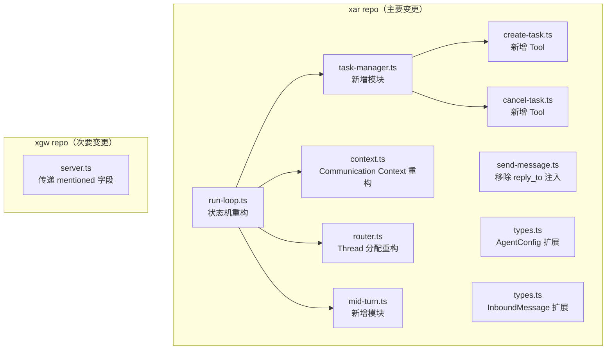
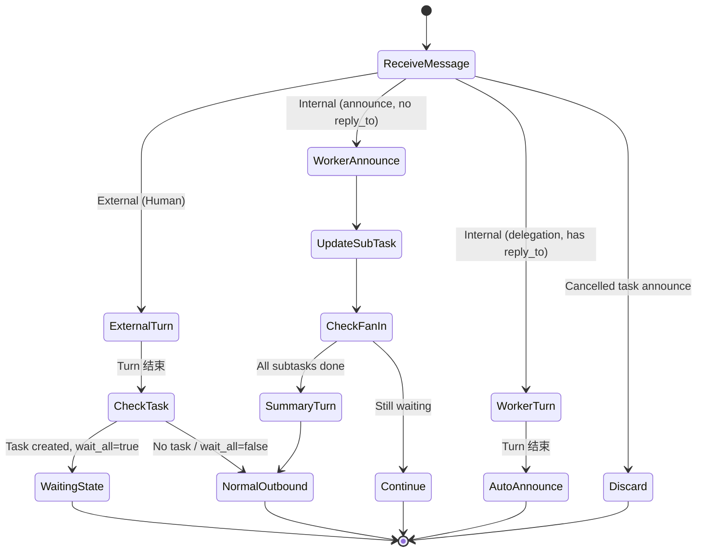

# 设计文档：Communication Refactor

## 概述

本次重构将 xar 的 Agent 运行时从当前的简单 send_message + reply_to 模型升级为 CommunicationDesign.md 中定义的完整通信架构。主要变更集中在 xar repo，涉及 run-loop、router、context、新增 task-manager 模块、新增 create_task/cancel_task 工具、AgentConfig 扩展。xgw 仅需少量修改（传递 mentioned 字段）。

核心设计原则：**代码层处理确定性的结构问题，LLM 层处理语义判断问题。**

## 架构

### 变更范围



### 模块依赖关系

```
run-loop.ts
  ├── router.ts          (Thread 分配)
  ├── context.ts         (Communication Context 构建)
  ├── task-manager.ts    (Task 生命周期管理)
  ├── mid-turn.ts        (Mid-Turn Injection)
  ├── send-message.ts    (send_message tool)
  ├── create-task.ts     (create_task tool)
  ├── cancel-task.ts     (cancel_task tool)
  └── deliver.ts         (出站投递，不变)
```

## 组件与接口

### 1. Task Manager（新增模块：`xar/src/agent/task-manager.ts`）

Task Manager 是代码层的协调核心，管理 Task/SubTask 的完整生命周期。

```typescript
// Task 对象
interface Task {
  task_id: string
  owner: string                    // orchestrator agent_id
  origin: {
    thread_id: string              // 来自哪个 Thread
    event_id: number               // 来自哪条消息
    reply_target: string           // "peer:<id>" 或 "agent:<id>"
  }
  status: 'pending' | 'waiting' | 'done' | 'failed' | 'cancelled'
  wait_all: boolean
  subtasks: SubTask[]
  created_at: string               // ISO 8601
  updated_at: string               // ISO 8601
}

interface SubTask {
  subtask_id: string               // 在 task 内唯一
  worker: string                   // worker agent_id
  instruction: string              // 委派给 worker 的任务描述
  status: 'pending' | 'sent' | 'done' | 'failed'
  result?: string                  // worker 的 plain text 结果
}

// Task Manager 接口
interface TaskManager {
  createTask(params: CreateTaskParams): Promise<Task>
  cancelTask(taskId: string): Promise<{ cancelled: boolean }>
  handleAnnounce(taskId: string, workerAgentId: string, result: string, failed: boolean): Promise<AnnounceResult>
  getTask(taskId: string): Promise<Task | null>
  getPendingTasks(): Promise<Task[]>
  isTaskCancelled(taskId: string): Promise<boolean>
}

interface CreateTaskParams {
  owner: string
  originThreadId: string
  originEventId: number
  replyTarget: string
  waitAll: boolean
  subtasks: Array<{ worker: string; instruction: string }>
}

interface AnnounceResult {
  taskCompleted: boolean           // 所有 subtask 是否已终结
  task: Task                       // 更新后的 task 对象
}
```

**持久化**：Task 对象以 JSON 文件存储在 `~/.theclaw/agents/<agent_id>/tasks/<task_id>.json`。每次状态变更后立即写入磁盘。

**task_id 生成**：使用 `<agent_id>-<timestamp>-<random>` 格式，保证全局唯一。

### 2. create_task Tool（新增：`xar/src/agent/create-task.ts`）

```typescript
// Tool Schema
{
  name: 'create_task',
  description: `Create a task with one or more subtasks delegated to worker agents.
Use this when you need to:
- Fan out work to multiple agents and wait for all results
- Delegate a task to a single agent and wait for the result
Set wait_all=true to receive a summary turn when all subtasks complete.
Set wait_all=false for fire-and-forget delegation.`,
  parameters: {
    type: 'object',
    properties: {
      subtasks: {
        type: 'array',
        items: {
          type: 'object',
          properties: {
            worker: { type: 'string', description: '"agent:<agent_id>"' },
            instruction: { type: 'string', description: '委派给 worker 的任务描述' }
          },
          required: ['worker', 'instruction']
        }
      },
      wait_all: {
        type: 'boolean',
        description: 'true: 等所有 subtask 完成后触发汇总 Turn; false: fire-and-forget'
      }
    },
    required: ['subtasks', 'wait_all']
  }
}
```

**执行流程**：
1. 生成 task_id，创建 Task 对象
2. 从当前 Turn 上下文推断 `origin.reply_target`
3. 向每个 worker 发送委派消息（internal 消息，携带 reply_to 指向 owner）
4. 更新 subtask status 从 pending 到 sent
5. 持久化 Task 对象
6. 返回 `{ task_id, status: "waiting" | "sent" }`

### 3. cancel_task Tool（新增：`xar/src/agent/cancel-task.ts`）

```typescript
// Tool Schema
{
  name: 'cancel_task',
  description: `Cancel a task and notify all active workers.
Workers will be notified asynchronously. Already-completed subtasks are not affected.`,
  parameters: {
    type: 'object',
    properties: {
      task_id: { type: 'string', description: '要取消的 task ID' }
    },
    required: ['task_id']
  }
}
```

**执行流程**：
1. 将 task status 设为 cancelled
2. 遍历所有 status=sent 的 subtask，向 worker 发送取消通知
3. 取消通知为 internal 消息，不携带 reply_to，subtype=cancellation
4. 持久化更新后的 Task 对象
5. 返回 `{ cancelled: true }`

### 4. AgentConfig 扩展（`xar/src/agent/types.ts`）

```typescript
interface AgentConfig {
  agent_id: string
  kind: 'system' | 'user'
  pai: {
    provider: string
    model: string
  }
  routing: {
    mode: 'reactive' | 'autonomous'     // 新增
    trigger: 'mention' | 'all'           // 新增，仅 reactive 群聊有意义
    override?: Record<string, string>    // 新增，自定义 Thread 分配规则
    // 移除旧的 default 字段
  }
  memory: {
    compact_threshold_tokens: number
    session_compact_threshold_tokens: number
  }
  retry: {
    max_attempts: number
  }
}
```

**向后兼容**：config 加载时，如果发现旧的 `routing.default` 字段，自动映射：
- `per-peer` → `{ mode: 'reactive', trigger: 'mention' }`
- `per-conversation` → `{ mode: 'autonomous' }`
- `per-agent` → `{ mode: 'autonomous' }`（保留 per-agent 作为 override）

### 5. InboundMessage 扩展（`xar/src/types.ts`）

```typescript
interface InboundMessage {
  source: string
  content: string
  event_type?: 'message' | 'record'
  reply_to?: string
  task_context?: string
  mentioned?: boolean              // 新增：xgw 传递的 mention 状态
  conversation_type?: string       // 新增：dm | group，辅助 xar 决策
}
```

### 6. Router 重构（`xar/src/agent/router.ts`）

Thread 分配策略从静态配置驱动改为 mode + 消息来源动态推导：

```typescript
function determineThreadId(config: AgentConfig, source: string): string {
  const parsed = parseSource(source)

  // Internal 消息：始终 per-internal-conv
  if (parsed.kind === 'internal') {
    // 从 conversation_id 提取 task_id（格式：internal:<orch_id>:<task_id>）
    // 但 source 格式是 internal:<conv_type>:<conv_id>:<sender>
    // conv_id 就是 <orch_id>:<task_id> 或直接是 task 相关 ID
    const taskId = parsed.conversation_id ?? 'unknown'
    return `internal/${taskId}`
  }

  // 检查 override
  if (config.routing.override) {
    // override 逻辑
  }

  // External 消息：根据 mode + conversation_type 推导
  if (config.routing.mode === 'reactive') {
    if (parsed.conversation_type === 'dm') {
      return `peers/${parsed.peer_id}`
    }
    // 群聊：per-conversation-peer
    return `conversations/${parsed.conversation_id}/peers/${parsed.peer_id}`
  }

  // Autonomous：per-conversation
  return `conversations/${parsed.conversation_id}`
}
```

### 7. Mention Gating 迁移

**xgw 变更**（`xgw/src/gateway/server.ts`）：
- 不再根据 `msg.mentioned` 决定 `event_type`
- 将 `mentioned` 字段透传到 IPC 入站消息
- 同时传递 `conversation_type`

**xar 变更**（`xar/src/agent/run-loop.ts`）：
- 在 processMessage 中，根据 AgentConfig 的 mode + trigger 决定 event_type
- Reactive + mention trigger + 群聊 + mentioned=false → record
- Reactive + all trigger → message
- Autonomous → message（LLM 自主决定是否回复）

### 8. Mid-Turn Injection（新增模块：`xar/src/agent/mid-turn.ts`）

```typescript
interface MidTurnInjector {
  /**
   * 在 tool call 执行完后调用，检查 Thread 是否有新的 Human 消息。
   * 如有，返回需要注入的 receive_user_update tool call + result 消息对。
   */
  checkAndInject(
    threadStore: ThreadStore,
    lastCheckedEventId: number,
  ): Promise<{ messages: Message[]; newLastCheckedId: number } | null>
}
```

**注入流程**：
1. 每次 tool 执行完后，调用 `checkAndInject`
2. 查询 Thread 中 id > lastCheckedEventId 的新事件
3. 过滤出 external source 的 message 类型事件
4. 如有新消息，构造 `receive_user_update` tool call + result
5. 将注入的消息写入 Thread（type=record, subtype=mid_turn_injection）
6. 返回构造的消息对，由 run-loop 插入 LLM messages

**System Prompt 说明**：
```
A special tool `receive_user_update` may appear in your tool call history.
It carries real-time updates from the user during task execution.
Treat its content as refinements to your current task, not a new request.
```

### 9. send_message 变更（`xar/src/agent/send-message.ts`）

**移除**：
- `deliverToAgent` 中不再注入 `task_context` 和 `reply_to`
- send_message 变为纯 fire-and-forget 消息发送

**保留**：
- `deliverToPeer`：通过 IPC 投递消息到 xgw（不变）
- `deliverToAgent`：通过 sendToAgent 投递消息（但不携带 reply_to）

### 10. Communication Context 重构（`xar/src/agent/context.ts`）

角色检测函数：

```typescript
type AgentRole = 'front-reactive' | 'front-autonomous' | 'worker' | 'worker-synthesizing' | 'orchestrator-synthesizing' | 'orchestrator-waiting' | 'participant'

function detectRole(
  message: InboundMessage,
  config: AgentConfig,
  taskContext?: TaskSummaryContext,
): AgentRole {
  const parsed = parseSource(message.source)

  if (parsed.kind === 'external') {
    // 检查是否有 pending task（Orchestrator waiting 场景）
    if (taskContext?.hasPendingTasks) return 'orchestrator-waiting'
    return config.routing.mode === 'reactive' ? 'front-reactive' : 'front-autonomous'
  }

  if (parsed.kind === 'internal') {
    if (taskContext?.isSummaryTurn) {
      // 汇总 Turn
      return message.reply_to ? 'worker-synthesizing' : 'orchestrator-synthesizing'
    }
    if (message.reply_to) return 'worker'
    return 'participant'
  }

  return 'front-reactive' // fallback
}
```

每个角色对应 CommunicationDesign.md §3.2 中的场景 A-F 模板。

### 11. Run-Loop 状态机重构（`xar/src/agent/run-loop.ts`）



**关键变更**：
1. processMessage 开头增加 Task 状态检查（是否为 cancelled task 的 announce）
2. Worker announce 路径：代码层更新 subtask → 检查 fan-in → 可能触发汇总 Turn
3. 汇总 Turn：注入所有 subtask 结果到 Communication Context
4. Mid-Turn Injection：在 tool call 循环中插入检查点

## 数据模型

### Task 持久化格式

```json
{
  "task_id": "admin-1719000000-abc123",
  "owner": "admin",
  "origin": {
    "thread_id": "peers/alice",
    "event_id": 42,
    "reply_target": "peer:alice"
  },
  "status": "waiting",
  "wait_all": true,
  "subtasks": [
    {
      "subtask_id": "st-1",
      "worker": "analyst",
      "instruction": "分析报告 X",
      "status": "sent",
      "result": null
    },
    {
      "subtask_id": "st-2",
      "worker": "researcher",
      "instruction": "搜索话题 Y",
      "status": "done",
      "result": "搜索结果..."
    }
  ],
  "created_at": "2026-04-01T10:00:00Z",
  "updated_at": "2026-04-01T10:05:00Z"
}
```

### Internal Source 地址格式变更

当前格式：`internal:<conv_type>:<conv_id>:<sender_agent_id>`

新增支持的 conv_id 格式：当 conv_type 为 `task` 时，conv_id 为 `<orchestrator_id>-<task_id>`。

示例：
- 委派消息：`internal:task:admin-task001:admin`（admin 向 worker 发送委派）
- Worker announce：`internal:task:admin-task001:analyst`（analyst 向 admin 回报结果）
- 取消通知：`internal:task:admin-task001:admin`（admin 向 worker 发送取消）

### Thread 目录结构变更

```
~/.theclaw/agents/<agent_id>/
├── threads/
│   ├── peers/<peer_id>/              # reactive 单聊
│   ├── conversations/
│   │   ├── <conv_id>/               # autonomous
│   │   └── <conv_id>/peers/<peer_id>/ # reactive 群聊
│   └── internal/<task_id>/           # agent 间通信
├── tasks/
│   └── <task_id>.json                # Task 持久化
└── ...
```


## 正确性属性

*属性（Property）是系统在所有合法执行中都应保持为真的特征或行为——本质上是关于系统应该做什么的形式化陈述。属性是人类可读规格与机器可验证正确性保证之间的桥梁。*

### Property 1: Task 创建正确性

*For any* 合法的 CreateTaskParams（包含 1-N 个 subtask、任意 wait_all 值），createTask 返回的 Task 对象应满足：
- task_id 非空且全局唯一
- owner 等于传入的 owner
- origin 字段完整（thread_id、event_id、reply_target）
- wait_all=true 时 status='waiting'，wait_all=false 时 status='sent'
- subtasks 数量等于传入的 subtask 数量，每个 subtask 的 status='sent'
- 向每个 worker 发送的委派消息使用 Internal_Conversation ID 格式 `internal:<orchestrator_id>:<task_id>`，且携带 reply_to 指向 owner

**Validates: Requirements 1.1, 1.2, 1.3, 1.4, 1.5, 11.1, 11.2**

### Property 2: Task 状态机转换正确性

*For any* 包含 N 个 subtask 的 Task（N≥1），按任意顺序对 subtask 调用 handleAnnounce：
- 每次 announce 后，对应 subtask 的 status 更新为 done 或 failed，result 被填充
- 前 N-1 次 announce 后，taskCompleted=false
- 第 N 次 announce 后（所有 subtask 终结），taskCompleted=true
- Task status 从 waiting 变为 done

**Validates: Requirements 1.6, 1.7, 10.2**

### Property 3: Task 持久化 round-trip

*For any* 合法的 Task 对象，序列化为 JSON 写入文件后再读取反序列化，应产生等价的 Task 对象。

**Validates: Requirements 1.8**

### Property 4: Task 取消正确性

*For any* 包含 N 个 subtask（部分 sent、部分 done）的 Task，调用 cancelTask 后：
- Task status 变为 cancelled
- 仅 status=sent 的 subtask 的 worker 收到取消通知
- 取消后再调用 handleAnnounce，返回的 taskCompleted=false 且 Task 状态不变

**Validates: Requirements 2.1, 2.2, 2.3**

### Property 5: Thread 分配正确性

*For any* AgentConfig（mode=reactive|autonomous）和 source 地址（external dm/group、internal），determineThreadId 返回的路径应满足：
- reactive + external dm → `peers/<peer_id>`
- reactive + external group → `conversations/<conv_id>/peers/<peer_id>`
- autonomous + external → `conversations/<conv_id>`
- internal → `internal/<task_id>`

**Validates: Requirements 4.1, 4.2, 4.3, 4.4, 11.3**

### Property 6: Event Type 判定正确性

*For any* AgentConfig（mode + trigger 组合）和入站消息（conversation_type + mentioned 组合），determineEventType 返回的值应满足：
- reactive + mention trigger + group + mentioned=false → 'record'
- reactive + mention trigger + group + mentioned=true → 'message'
- reactive + mention trigger + dm → 'message'（dm 始终触发）
- reactive + all trigger → 'message'
- autonomous → 'message'

**Validates: Requirements 3.3, 3.4, 3.5, 9.2**

### Property 7: 角色检测正确性

*For any* 入站消息（source kind + reply_to 有无 + taskContext 有无），detectRole 返回的角色应满足：
- external source + 无 pending task → front-reactive 或 front-autonomous（取决于 config.mode）
- external source + 有 pending task → orchestrator-waiting
- internal source + 有 reply_to + 非汇总 → worker
- internal source + 有 reply_to + 汇总 → worker-synthesizing
- internal source + 无 reply_to + 汇总 → orchestrator-synthesizing
- internal source + 无 reply_to + 非汇总 → participant

**Validates: Requirements 5.1, 5.2, 5.3, 5.4**

### Property 8: Communication Context 生成正确性

*For any* 角色和对应的输入参数，buildCommunicationContext 生成的 context 字符串应满足：
- 第一行包含 agent 身份锚点（`You are: agent:<id>`）
- 包含明确的出站义务描述
- Worker 角色包含 "DO NOT use send_message to reply" 指令
- Orchestrator-synthesizing 角色包含所有 subtask 结果
- Autonomous 角色包含 "You decide whether to respond" 指令
- 末尾包含 Available agents 列表

**Validates: Requirements 6.1, 6.2, 6.3, 6.4, 6.5, 6.6, 6.7**

### Property 9: send_message 纯净性

*For any* send_message 调用（target=agent:xxx），发送给目标 agent 的 InboundMessage 不应包含 reply_to 或 task_context 字段。

**Validates: Requirements 8.1, 8.4**

### Property 10: Mid-Turn Injection 构造正确性

*For any* Thread 中在 lastCheckedEventId 之后新增的 Human 消息列表，checkAndInject 应返回：
- 一对 messages：assistant tool_call（name=receive_user_update）+ tool result（包含新消息内容）
- 无新消息时返回 null
- newLastCheckedId 更新为最新事件 ID

**Validates: Requirements 7.2**

### Property 11: Source 地址解析正确性

*For any* 合法的 source 地址字符串（external 或 internal 格式），parseSource 应正确提取所有字段，且 `buildSource(parseSource(s))` 应产生等价的地址字符串（round-trip）。

**Validates: Requirements 4.1, 4.2, 4.3, 4.4（间接依赖）**

## 错误处理

### Task Manager 错误

| 场景 | 处理方式 |
|------|---------|
| create_task 中 worker agent 不存在 | 返回错误，不创建 Task |
| create_task 中 sendToAgent 失败 | SubTask status 保持 pending，Task 记录失败信息 |
| cancel_task 中 task_id 不存在 | 返回 `{ cancelled: false, message: 'task not found' }` |
| cancel_task 中 task 已完成 | 返回 `{ cancelled: false, message: 'task already completed' }` |
| handleAnnounce 中 task 已 cancelled | 丢弃 announce，返回 `{ taskCompleted: false }` |
| Task JSON 文件读写失败 | 记录错误日志，不影响内存中的 Task 状态 |

### Run-Loop 错误

| 场景 | 处理方式 |
|------|---------|
| 汇总 Turn 中 LLM 调用失败 | 记录错误到 Thread，通知 origin.reply_target 任务失败 |
| Mid-Turn Injection 中 Thread 读取失败 | 跳过注入，继续正常 tool call 流程 |
| Worker announce 路由失败 | 记录错误日志，SubTask 保持 sent 状态 |

### 向后兼容

| 场景 | 处理方式 |
|------|---------|
| 旧 AgentConfig 使用 routing.default | 自动映射到新的 mode/trigger 字段 |
| 旧 InboundMessage 无 mentioned 字段 | 默认为 undefined，xar 按 dm 逻辑处理（event_type=message） |

## 测试策略

### 测试框架

- 单元测试 + 属性测试：vitest + fast-check
- 测试文件位置：`xar/vitest/unit/` 和 `xar/vitest/pbt/`
- 属性测试每个 property 至少 100 次迭代

### 属性测试（PBT）

每个 Correctness Property 对应一个 property-based test，使用 fast-check 生成随机输入：

| Property | 测试文件 | Generator 策略 |
|----------|---------|---------------|
| P1: Task 创建 | `task-manager.pbt.test.ts` | 随机 subtask 列表（1-10 个）、随机 wait_all |
| P2: Task 状态机 | `task-manager.pbt.test.ts` | 随机 subtask 数量、随机 announce 顺序 |
| P3: Task 持久化 | `task-manager.pbt.test.ts` | 随机 Task 对象 |
| P4: Task 取消 | `task-manager.pbt.test.ts` | 随机 subtask 状态分布 |
| P5: Thread 分配 | `router.pbt.test.ts` | 随机 mode/source 组合 |
| P6: Event Type | `router.pbt.test.ts` | 随机 mode/trigger/conv_type/mentioned 组合 |
| P7: 角色检测 | `context.pbt.test.ts` | 随机 source/reply_to/taskContext 组合 |
| P8: Context 生成 | `context.pbt.test.ts` | 随机角色 + 输入参数 |
| P9: send_message | `send-message.pbt.test.ts` | 随机 agent target |
| P10: Mid-Turn | `mid-turn.pbt.test.ts` | 随机新消息列表 |
| P11: Source 解析 | `router.pbt.test.ts` | 随机 source 地址字符串 |

每个 property test 必须包含注释引用设计文档中的 property：
```typescript
// Feature: communication-refactor, Property 5: Thread 分配正确性
```

### 单元测试

单元测试聚焦于具体示例和边界情况：

| 模块 | 测试文件 | 重点 |
|------|---------|------|
| task-manager | `task-manager.test.ts` | 空 subtask 列表、单 subtask、重复 announce |
| router | `router.test.ts` | 旧 config 向后兼容、malformed source |
| context | `context.test.ts` | 各场景模板的具体输出验证 |
| send-message | `send-message.test.ts` | peer 不存在、IPC 断开 |
| mid-turn | `mid-turn.test.ts` | 无新消息、多条新消息 |
| create-task | `create-task.test.ts` | worker 不存在、sendToAgent 失败 |
| cancel-task | `cancel-task.test.ts` | task 不存在、task 已完成 |

### xgw 测试

| 模块 | 测试文件 | 重点 |
|------|---------|------|
| server | `server.test.ts` | mentioned 字段透传、conversation_type 透传 |
