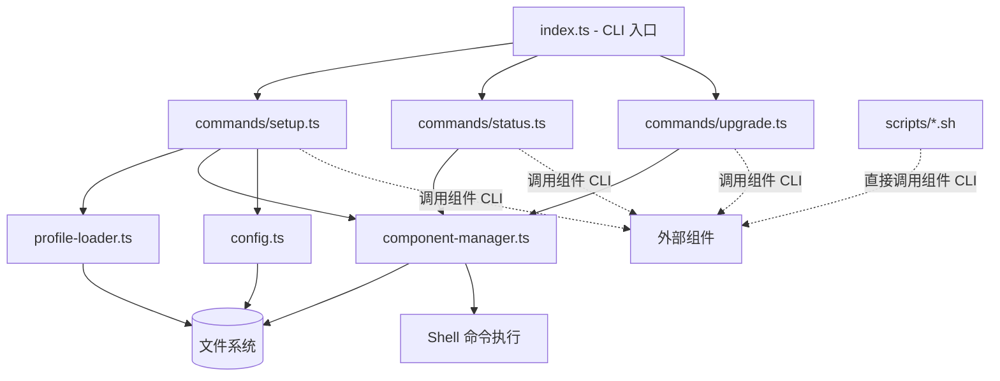

# 设计文档：TheClaw CLI

## 概述

TheClaw CLI 是一个轻量的编排层工具，负责 agent 运行时平台的组装、配置与观测。它遵循"薄壳层"原则——自身不实现业务逻辑，只通过调用各组件的 CLI 命令来完成安装、配置和状态聚合。

核心设计决策：
- **components.yaml 驱动**：组件版本和安装方式集中声明，与 npm 生态解耦
- **Profile 驱动初始化**：setup 行为完全由 profile 文件声明，支持不同环境配置
- **幂等性**：setup 可重复执行，已完成步骤自动跳过
- **可观测性优先**：提供独立于 theclaw 命令的纯 bash 脚本，供人类和 maintainer agent 使用

---

## 架构



### 关键架构决策

1. **Shell 命令执行集中管理**：所有 shell 命令调用通过 `os-utils.ts` 中的统一函数执行，便于测试和错误处理
2. **无运行时依赖**：theclaw 不在 package.json 中声明其他组件为依赖，组件管理完全通过 components.yaml
3. **配置边界清晰**：theclaw 只写入自己的配置文件，其他组件配置通过调用各组件 CLI 命令写入

---

## 组件与接口

### `src/index.ts` - CLI 入口

使用 commander 注册三个子命令，解析全局选项，分发到对应命令处理器。

```typescript
// 命令注册
program
  .command('setup')
  .option('--profile <name|path>', 'profile 名称或路径', 'standard')
  .option('--reset', '清除已有配置重新初始化')
  .action(runSetup)

program
  .command('status')
  .option('--json', '输出 JSON 格式')
  .option('--deep', '深度连通性检查')
  .action(runStatus)

program
  .command('upgrade')
  .option('--component <name>', '只升级指定组件')
  .option('--dry-run', '只显示操作，不实际执行')
  .action(runUpgrade)
```

### `src/component-manager.ts` - 组件管理器

负责解析 components.yaml、检测组件安装状态、执行安装命令。

```typescript
interface ComponentManager {
  loadComponents(yamlPath: string): Promise<ComponentsConfig>
  isInstalled(component: ComponentDef): Promise<boolean>
  getInstalledVersion(component: ComponentDef): Promise<string | null>
  install(component: ComponentDef, dryRun?: boolean): Promise<void>
  checkAll(): Promise<ComponentStatus[]>
}
```

版本比较逻辑：
- 执行 `<command> --version`，从输出中提取 semver 格式版本号（正则 `/(\d+\.\d+\.\d+)/`）
- 使用字符串比较判断是否需要升级（目标版本 !== 当前版本）

### `src/profile-loader.ts` - Profile 加载器

负责解析 profile YAML 文件，识别并交互式填充占位符。

```typescript
interface ProfileLoader {
  load(nameOrPath: string, profilesDir: string): Promise<Profile>
  extractPlaceholders(profile: Profile): string[]
  fillPlaceholders(profile: Profile, values: Record<string, string>): Profile
}
```

占位符识别：正则 `/\$\{([A-Z_][A-Z0-9_]*)\}/g` 匹配所有 `${VAR}` 格式变量。

### `src/commands/setup.ts` - Setup 命令

按顺序执行 setup 步骤，每步完成后记录到配置文件实现幂等性。

```typescript
const SETUP_STEPS = [
  'install-components',
  'load-profile',
  'configure-pai',
  'init-agents',
  'start-notifier',
  'configure-xgw',
  'start-agents',
  'smoke-test',
] as const
```

幂等性实现：读取 `~/.config/theclaw/config.json` 中的 `completed_steps` 数组，跳过已完成步骤。

### `src/commands/status.ts` - Status 命令

并发调用各组件 status 命令，聚合结果。

```typescript
interface StatusResult {
  notifier: NotifierStatus
  xgw: XgwStatus
  agents: AgentStatus[]
}
```

### `src/commands/upgrade.ts` - Upgrade 命令

读取 components.yaml，比较版本，执行升级，重启受影响服务。

### `src/config.ts` - 配置管理

读写 `~/.config/theclaw/config.json`，处理环境变量覆盖。

### `src/types.ts` - 共享类型定义

所有跨模块共享的 TypeScript 类型。

---

## 数据模型

### ComponentsConfig（components.yaml 结构）

```typescript
interface ComponentDef {
  version: string      // 目标版本，如 "0.5.0"
  command: string      // 可执行命令名，用于 which 检测
  install: string      // 完整安装命令
}

interface ComponentsConfig {
  schema_version: string
  components: Record<string, ComponentDef>
}
```

### Profile（profile YAML 结构）

```typescript
interface ProfileStep {
  type: string         // 步骤类型，如 "pai-config"、"agent-init"
  [key: string]: unknown  // 步骤特定参数
}

interface Profile {
  name: string
  steps: ProfileStep[]
}
```

### TheClawConfig（~/.config/theclaw/config.json）

```typescript
interface TheClawConfig {
  schema_version: string           // "1"
  profile: string                  // 使用的 profile 名称
  setup_completed_at?: string      // ISO 8601 时间戳
  components_yaml_path: string     // components.yaml 绝对路径
  completed_steps?: string[]       // 已完成的 setup 步骤列表（幂等性）
}
```

### ComponentStatus（组件状态）

```typescript
interface ComponentStatus {
  name: string
  installed: boolean
  currentVersion: string | null
  targetVersion: string
  needsUpgrade: boolean
}
```

### StatusResult（status 命令输出）

```typescript
interface NotifierStatus {
  running: boolean
  pid?: number
}

interface XgwChannel {
  id: string
  type: string
  healthy: boolean
}

interface XgwStatus {
  running: boolean
  pid?: number
  channels?: XgwChannel[]
}

interface AgentStatus {
  id: string
  kind: string
  started: boolean
  inbox_pending: number
  last_activity?: string
}

interface StatusResult {
  notifier: NotifierStatus
  xgw: XgwStatus
  agents: AgentStatus[]
}
```

### HealthCheckResult（health 脚本输出）

```typescript
interface HealthCheck {
  name: string
  status: 'ok' | 'warning' | 'error'
  detail?: string
}

interface HealthCheckResult {
  healthy: boolean
  checks: HealthCheck[]
}
```

---

## 正确性属性

*属性（Property）是在系统所有合法执行中都应成立的特征或行为——本质上是对系统应做什么的形式化陈述。属性作为人类可读规格与机器可验证正确性保证之间的桥梁。*

### 基于属性的测试概述

属性测试通过对大量生成输入验证通用属性来确保软件正确性。每个属性都是一个形式化规格，应对所有合法输入成立。

---

### 属性 1：ComponentsYaml 解析往返一致性

*对于任意* 合法的 `ComponentsConfig` 对象（含任意数量的组件定义，每个组件有 version、command、install 字段），将其序列化为 YAML 后再解析，应得到与原始对象等价的结果，且所有组件定义均被完整保留。

**验证：需求 1.1、1.2**

---

### 属性 2：占位符提取完整性与唯一性

*对于任意* 包含零个或多个 `${VAR}` 格式占位符的字符串，`extractPlaceholders` 函数提取出的结果应满足：
- 结果集合中的每个变量名都确实出现在原字符串中
- 原字符串中每个 `${VAR}` 格式的变量名都出现在结果集合中
- 结果集合中无重复元素（唯一性）

**验证：需求 3.2、3.3**

---

### 属性 3：占位符填充完整性

*对于任意* 模板字符串和完整的占位符值映射（映射覆盖模板中所有占位符），`fillPlaceholders` 填充后的字符串不应包含任何 `${VAR}` 格式的未替换占位符。

**验证：需求 3.4**

---

### 属性 4：占位符填充幂等性

*对于任意* 模板字符串和占位符值映射，对已完全填充的结果再次执行 `fillPlaceholders`（使用相同映射），结果应与第一次填充后完全相同。即 `fill(fill(template, values), values) === fill(template, values)`。

**验证：需求 3.4**

---

### 属性 5：版本号提取鲁棒性

*对于任意* 包含 semver 格式版本号（`x.y.z`）的字符串（模拟 `--version` 命令输出，可能含前缀 `v`、额外文本、多行内容），版本号提取函数应能正确提取出 `x.y.z` 格式的版本字符串；对于不含任何 semver 格式的字符串，应返回 `null`。

**验证：需求 1.5**

---

### 属性 6：dry-run 无副作用

*对于任意* 组件列表（无论版本是否匹配），在 `--dry-run` 模式下执行 upgrade，实际 shell 命令执行次数应为 0——即不调用任何安装命令或重启命令。

**验证：需求 5.4**

---

### 属性 7：status JSON 输出结构完整性

*对于任意* 模拟的系统状态数据，`--json` 模式下 `formatStatusJson` 的输出应满足：
- 是合法的 JSON 字符串（`JSON.parse` 不抛出异常）
- 解析后的对象包含 `notifier`、`xgw`、`agents` 三个顶层字段
- `agents` 字段是数组

**验证：需求 4.3、4.6**

---

### 属性 8：配置文件读写往返一致性

*对于任意* 合法的 `TheClawConfig` 对象，将其通过 `writeConfig` 写入临时文件后，再通过 `readConfig` 读取，应得到与原始对象字段值完全相同的结果。

**验证：需求 7.1、7.4**

---

### 属性 9：setup 幂等性

*对于任意* 非空的已完成步骤集合（存储在配置文件中），在不指定 `--reset` 的情况下调用 setup 执行器，`shouldSkipStep` 对集合中每个步骤应返回 `true`，即这些步骤不会被重复执行。

**验证：需求 2.5**

---

### 属性 10：错误状态不中断 status 聚合

*对于任意* 组件名称列表（其中任意子集的 status 命令被模拟为失败），status 聚合函数应返回包含所有组件的结果列表，失败组件的状态标记为 `error`，成功组件的状态正常填充，整体不抛出异常。

**验证：需求 4.5**

---

### 属性 11：--component 过滤正确性

*对于任意* 组件列表和指定的组件名称，upgrade 过滤逻辑应满足：结果列表中有且仅有名称匹配的组件，其他组件不被处理（执行次数为 0）。

**验证：需求 5.3**

---

### 属性 12：非法 YAML 输入错误处理

*对于任意* 不符合 ComponentsYaml schema 的输入（格式非法的 YAML 字符串，或缺少必要字段的对象），解析函数应抛出包含描述性信息的错误，而非返回部分结果或静默失败。

**验证：需求 1.3、3.6**

---

## 错误处理

### 退出码规范

| 退出码 | 含义 | 场景 |
|--------|------|------|
| 0 | 成功 | 命令正常完成 |
| 1 | 运行时错误 | 组件安装失败、配置错误、YAML 解析失败 |
| 2 | 参数错误 | 未知命令、profile 文件不存在、组件名称无效 |

### 错误处理策略

- **组件安装失败**：输出失败原因，返回退出码 1，不继续后续步骤
- **status 命令中组件失败**：标记该组件为 error 状态，继续检查其他组件
- **YAML 解析失败**：输出文件路径和解析错误详情，返回退出码 1
- **配置目录不存在**：自动创建所需目录（`mkdir -p`）
- **环境变量未设置**：使用默认值，不报错

### 错误输出格式

所有错误信息输出到 stderr，正常输出到 stdout，便于脚本管道处理。

---

## 测试策略

### 双轨测试方法

**单元测试**（vitest）：
- 验证特定示例和边界情况
- 测试错误条件和异常路径（退出码 1、2 的具体场景）
- 测试版本号提取的边界情况（带 `v` 前缀、多行输出、无版本号）
- 测试 profile 文件不存在、格式非法等具体错误场景

**属性测试**（vitest + fast-check）：
- 验证对所有输入都成立的通用属性
- 每个属性测试最少运行 100 次迭代
- 覆盖上述 12 个正确性属性

### 属性测试配置

使用 `fast-check` 库进行属性测试：

```typescript
import fc from 'fast-check'

// 示例：占位符填充完整性测试
// Feature: theclaw-cli, Property 3: 占位符填充完整性
test('占位符填充后不含未替换变量', () => {
  fc.assert(
    fc.property(
      fc.string(),
      (template) => {
        const placeholders = extractPlaceholders(template)
        const values = Object.fromEntries(placeholders.map(p => [p, 'value']))
        const result = fillPlaceholders(template, values)
        return !/\$\{[A-Z_][A-Z0-9_]*\}/.test(result)
      }
    ),
    { numRuns: 100 }
  )
})
```

每个属性测试必须包含注释标注对应的设计属性编号：
```
// Feature: theclaw-cli, Property N: <属性描述>
```

### 属性到测试文件的映射

| 属性 | 测试文件 | 测试方式 |
|------|----------|----------|
| P1: ComponentsYaml 往返 | `component-manager.test.ts` | fast-check 生成随机组件定义 |
| P2: 占位符提取完整性 | `profile-loader.test.ts` | fast-check 生成含占位符字符串 |
| P3: 占位符填充完整性 | `profile-loader.test.ts` | fast-check 生成模板和值映射 |
| P4: 占位符填充幂等性 | `profile-loader.test.ts` | fast-check 验证二次填充不变 |
| P5: 版本号提取鲁棒性 | `component-manager.test.ts` | fast-check 生成各种版本输出格式 |
| P6: dry-run 无副作用 | `upgrade.test.ts` | mock shell 执行器，验证调用次数为 0 |
| P7: status JSON 结构 | `status.test.ts` | fast-check 生成随机状态数据 |
| P8: 配置读写往返 | `config.test.ts` | fast-check + 临时目录 |
| P9: setup 幂等性 | `setup.test.ts` | fast-check 生成已完成步骤集合 |
| P10: 错误不中断聚合 | `status.test.ts` | fast-check 随机失败组件子集 |
| P11: --component 过滤 | `upgrade.test.ts` | fast-check 生成组件列表和目标名 |
| P12: 非法 YAML 错误处理 | `component-manager.test.ts` | fast-check 生成非法输入 |

### 可测试模块

- `profile-loader.ts`：占位符提取、填充逻辑（纯函数，最易测试）
- `component-manager.ts`：YAML 解析、版本号提取（通过 mock shell 命令测试）
- `config.ts`：配置读写（通过临时目录测试）
- `commands/upgrade.ts`：dry-run 逻辑、组件过滤（通过 mock 验证无副作用）
- `commands/status.ts`：JSON 输出结构、错误隔离（通过 mock 组件 CLI 测试）
- `commands/setup.ts`：幂等性判断逻辑（通过 mock 配置文件测试）

### 不测试的内容

- 实际 shell 命令执行（集成测试范畴）
- 交互式 prompt（需要 TTY 环境）
- 可观测性脚本（纯 bash，通过手动测试验证）
- graceful restart 流程（依赖真实服务状态）
